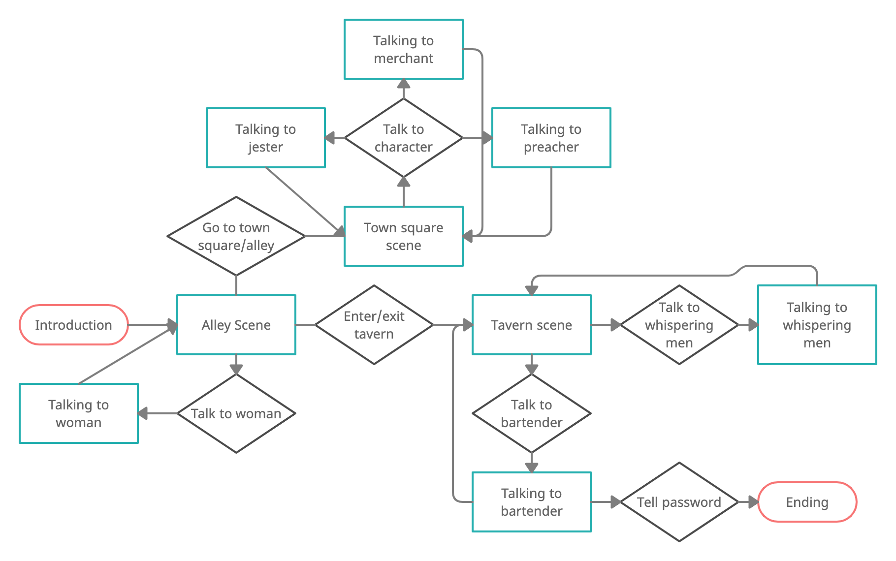
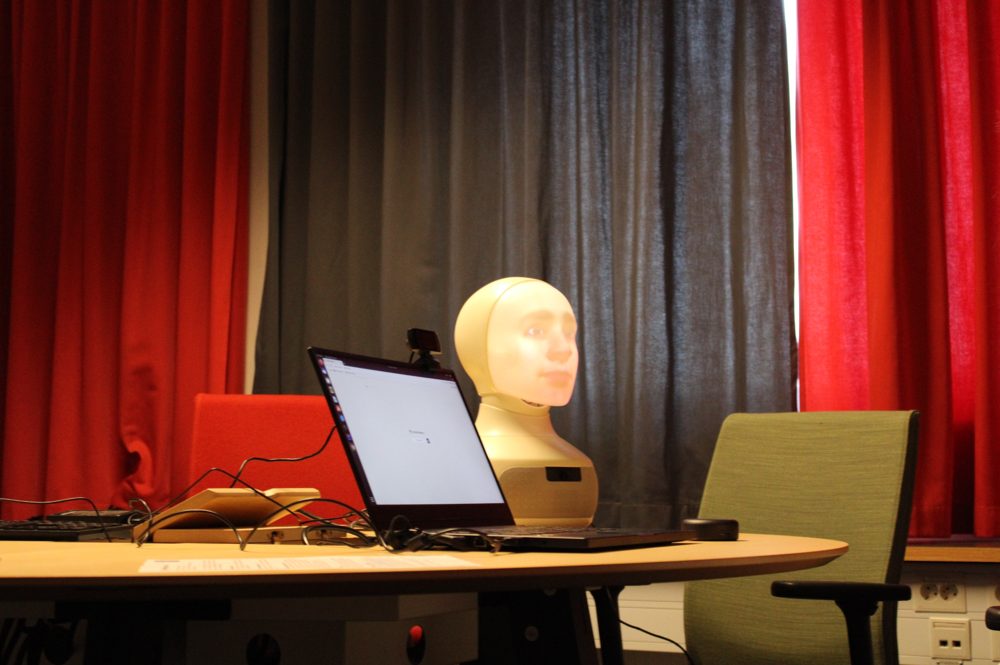
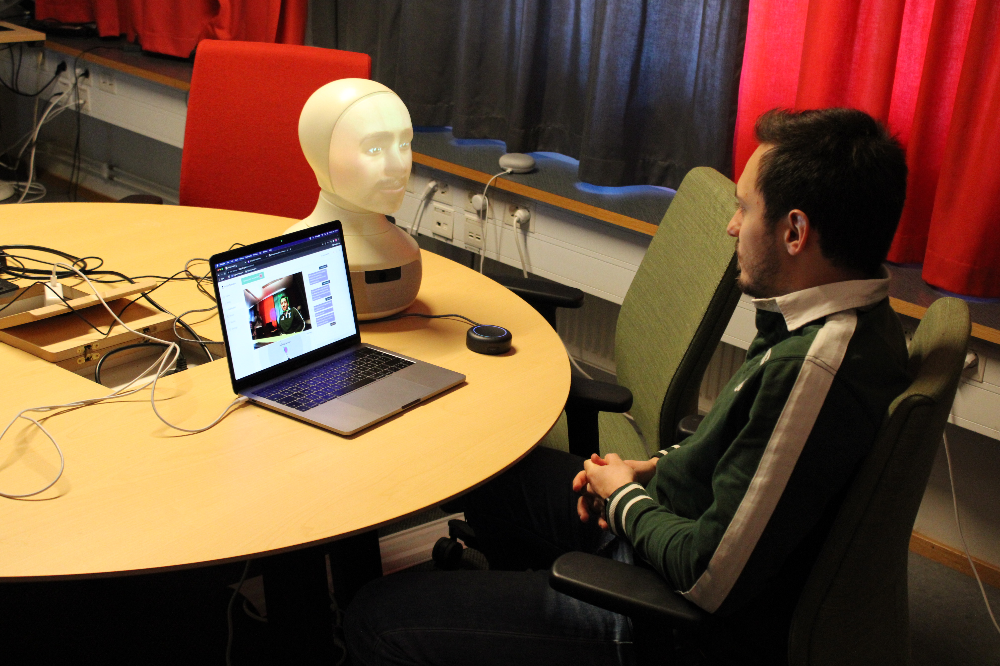

# The Influence of Emotion Detection on User's Engagement in an Interactive Storytelling Scenario

This is the code for the project report:

S. Antaris, W. Eriksson and P. Mondorf: [The Influence of Emotion Detection on User's Engagement in an Interactive Storytelling Scenario](ProjectReport.pdf), Project Report, Division of Speech, Music and Hearing, KTH Royal Institute of Technology, 2022.

Storytelling is fundamental to our human nature and strongly rooted in our culture. It allows us to efficiently communicate knowledge in social contexts [[1]](#1). Therefore, it emerges as an essential component to intelligent computer systems, and in particular conversational agents [[2]](#2).

Typically, storytelling conversational systems interact with another physical person to narrate a story and adjust the story according to the person’s actions [[3]](#3). The main goal of these conversational systems is to attract the physical person’s attention and engage the person during the overall story. Detecting user emotions is essential for the success of such storytelling conversational systems as emotions play an essential role in human communication [[4]](#4).

In this work, we implemented a conversational storytelling system using the [FurhatSDK](https://furhatrobotics.com/), to narrate an interactive story in which users can actively change the course of events by communicating their actions to the storyteller. We periodically detect user emotions and adjust the storytelling system's responses respectively to attract the user’s attention.

Preliminary results from our experiments demonstrate no statistically significant benefit in terms of user engagement when the emotion detection component is activated.
However, our results indicate that the participants which exploited the emotion detection component experienced less misunderstandings during the story. Similarly, participants perceived the robotic storyteller as more intelligent when it was capable of detecting emotions than participants who tested the robot without emotion detection.

<br />

If you find this work useful for your research, please cite it as: 

```
@ARTICLE{EmotionDetectionForStorytelling,
    author = {S. {Antaris} and W. {Eriksson} and P. {Mondorf}},
    title = {The Influence of Emotion Detection on User's Engagement in an Interactive Storytelling Scenario},
    journal={Technical Report},
    year = {2022}
}
```

## Implementation of the Storyteller

For building the storyteller, we used the [Furhat robot](https://furhatrobotics.com/) which has gesture and direct gaze capabilities, which benefits the user’s attention during a storytelling [[5]](#5). As illustrated in Figure 1, the story used in the experiment was modelled as a finite-state machine, where each state was defined by an entry action, as well as a number of transition possibilities. A transition from one state to another was triggered by an intent from the user through spoken utterances. The storyline was inspired by a one page adventure by Tyler Monahan [[6]](#6), and takes place in a medieval age setting in the fictional town of Millstone.


*Fig. 1: State chart outlining the flow of the storyline. States are indicated with teal rectangles and intents with black diamonds. Starting and ending states are marked as red rounded rectangles.*

## Emotion Detection

While interacting with the storyteller, the user’s face was being recorded with a camera connected to an external device, performing real-time emotion detection. The user’s facial expressions were registered and classified once every second, and then used by the FurhatSDK in order to influence the story line.

In order to build our emotion detection service, we used [OpenCV](https://opencv.org/) for video management and facial recognition, and a prebuilt CNN in [Keras](https://keras.io/) for emotion detection. The procedure was heavily influenced by an implementation made by Karan Sethi [[7]](#7), [[8]](#8), who also trained the prebuilt model.

## Experimental Design

We conducted experiments on 16 individual persons and validated the influence of the emotion detection on the users’ engagement based on a post-experiment questionnaire. Our experiment follows a two condition, between-subject design where participants are asked to interact with the robotic storyteller. In particular, the storyteller guides participants through an interactive story in which they have the chance to alter the course of events by verbally telling the robot which actions they want to pursue in the story. In order to address the influence of emotion detection on the users’ engagement into the story, we investigate two different experimental conditions:

- a setup with emotion detection enabled and incorporated into the story line
- a setup without emotion detection

<p float="left">
  
   
</p>

*Fig. 2: The experimental setup. The robotic storyteller is placed next to a computer that textually displays the current conversation. An external camera is capturing the facial expressions of the participants to infer their emotional state.*

<br />

For more details, please check out our [project report](ProjectReport.pdf).


## References
<a id="1">[1]</a> M. M. Louwerse, R. Dale, E. G. Bard, and P. Jeuniaux, “Behavior matching in multimodal communication is synchronized,” Cognitive science, vol. 36 8, pp. 1404–26, 2012.

<a id="2">[2]</a> M. Ochs and C. Pelachaud, “Model of the perception of smiling virtual character,” in: *Proceedings of the 11th International Conference on Autonomous Agents and Multiagent Systems - Volume 1*, ser. AAMAS ’12. Richland, SC: International Foundation for Autonomous Agents and Multiagent Systems, 2012, p. 87–94.

<a id="3">[3]</a> D. Jackson and A. Latham, “Talk to the ghost: The storybox methodology for faster development of storytelling chatbots,” *Expert Systems with Applications*, vol. 190, p. 116223, 2022

<a id="4">[4]</a> I. Torre, S. Tuncer, D. McDuff, and M. Czerwinski, “Exploring the effects of virtual agents’ smiles on human-agent interaction: A mixed-methods study,” 09 2021.

<a id="5">[5]</a> C. L. Sidner, C. D. Kidd, C. Lee, and N. Lesh, “Where to look: a study of human-robot engagement,” in: *Proceedings of the 9th international conference on Intelligent user interfaces*, 2004, pp. 78–84.

<a id="6">[6]</a> T. Monahan, “One page adventures,” last accessed 18 January 2022. [Online]. Available: https://drive.google.com/file/d/1jvrAUnW0ijrl3uZHeh3AaxpxV5rlzqdc/view

<a id="6">[7]</a> “Emotion detection using opencv and keras“. Accessed 2022-01-19. [Online]. Available: https://medium.com/swlh/emotion-detection-using-opencv-and-keras-771260bbd7f7

<a id="6">[8]</a> “Emotion detection using deep learning“. Accessed 2022-01-19. [Online]. Available: https://github.com/atulapra/Emotion-detection